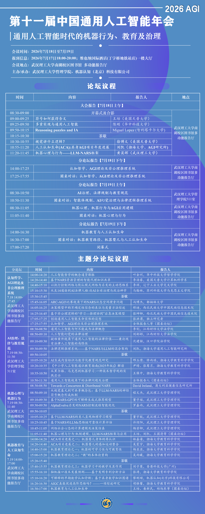

# 第十一届中国通用人工智能年会

**时间地点**：2026年7月18-19日，武汉理工大学南湖校区（湖北武汉）

**会议主题**：封面海报为“AGI时代的机器心理、行为及教育与法律治理”；议程材料为“通用人工智能时代的机器行为、教育及治理”。

## 会议视频

| 日期 | 分会场 | B站链接 |
|------|--------|---------|
| 第一天上午 | 大会主旨报告 | [BV1AmGc6VEBG](https://www.bilibili.com/video/BV1AmGc6VEBG) |
| 第一天下午 | 认知哲学、AGI理论及NARS分论坛 | [BV1kuGc6uExY](https://www.bilibili.com/video/BV1kuGc6uExY) |
| 第二天下午 | 机器教育与人工认知生命分论坛 | [BV1TDGT6vEBt](https://www.bilibili.com/video/BV1TDGT6vEBt) |

第二天上午的 AI 治理、法律规制与教育规范分论坛，以及机器心理、机器行为与 AGI 应用建模分论坛，本轮暂未在协会 B 站空间和站内精确检索结果中找到对应的独立视频条目。

## 会议内容

### 第一天上午 · 大会主旨报告

| # | 来源 | 报告人 | 报告标题 |
|---|------|--------|---------|
| 1 | [B站](https://www.bilibili.com/video/BV1AmGc6VEBG?p=1) | 王培 | 符号如何获得含义 |
| 2 | [B站](https://www.bilibili.com/video/BV1AmGc6VEBG?p=2) | 陈刚 | 多重实现与通用人工智能 |
| 3 | [B站](https://www.bilibili.com/video/BV1AmGc6VEBG?p=3) | Miguel Lopez | Reasoning puzzles and IA |
| 4 | [B站](https://www.bilibili.com/video/BV1AmGc6VEBG?p=4) | 徐博文 | 视觉讲什么逻辑？ |
| 5 | [B站](https://www.bilibili.com/video/BV1AmGc6VEBG?p=5) | 刘凯 | 人工认知生命（ACA）：具身AGI项目年度进展 |
| 6 | [B站](https://www.bilibili.com/video/BV1AmGc6VEBG?p=6) | 黄英辉 | 机器心理与行为——LLM-NARS框架 |

### 第一天下午 · 认知哲学、AGI理论及NARS分论坛

| # | 来源 | 报告人 | 报告标题 |
|---|------|--------|---------|
| 1 | [B站](https://www.bilibili.com/video/BV1kuGc6uExY?p=1) | 叶金州 | 人工智能哲学的概念通货膨胀 |
| 2 | [B站](https://www.bilibili.com/video/BV1kuGc6uExY?p=2) | 李汤睿 | 基于NARS资源管理的智能代理知识共享平台 |
| 3 | [B站](https://www.bilibili.com/video/BV1kuGc6uExY?p=3) | 李祥 | 以执行控制网络与默认模式网络为启发的主动思维系统 |
| 4 | [B站](https://www.bilibili.com/video/BV1kuGc6uExY?p=4) | 马翰林 | 从良14通谕到AI法律人格：论AI全球治理与政治神学 |
| 5 | [B站](https://www.bilibili.com/video/BV1kuGc6uExY?p=5) | 冯博杰 | ARC-AGI3比赛视角下的NARS状态空间搜索问题 |
| 6 | [B站](https://www.bilibili.com/video/BV1kuGc6uExY?p=6) | 张坤柳 | 基于非公理逻辑的“学习—推理协同”应急决策模型 |
| 7 | [B站](https://www.bilibili.com/video/BV1kuGc6uExY?p=7) | 张洪湧 | 创造通用人工智能生命实体的设想 |
| 8 | [B站](https://www.bilibili.com/video/BV1kuGc6uExY?p=8) | 那迪 | 决策模型中的不确定性信念的表征与度量方法综述 |

### 第二天下午 · 机器教育与人工认知生命分论坛

| # | 来源 | 报告人 | 报告标题 |
|---|------|--------|---------|
| 1 | [B站](https://www.bilibili.com/video/BV1TDGT6vEBt?p=1) | 林嘉濠 | ACA项目进展之一：机器婴儿身体的再认识 |
| 2 | [B站](https://www.bilibili.com/video/BV1TDGT6vEBt?p=2) | 吴震宇 | ACA项目进展之二：机器婴儿的感知运动整合 |
| 3 | [B站](https://www.bilibili.com/video/BV1TDGT6vEBt?p=3) | 杨亚亚 | 机器教育理论之一：机器的可学习性与可教育性 |
| 4 | [B站](https://www.bilibili.com/video/BV1TDGT6vEBt?p=4) | 吴雨曦 | 机器教育理论之二：“教”的本体论重构 |
| 5 | [B站](https://www.bilibili.com/video/BV1TDGT6vEBt?p=5) | 刘子莫 | 机器教育理论之三：机器学习中的教学及其作用 |
| 6 | [B站](https://www.bilibili.com/video/BV1TDGT6vEBt?p=6) | 张涛 | 脑机接口技术发展预测——基于发明专利分析方法 |
| 7 | [B站](https://www.bilibili.com/video/BV1TDGT6vEBt?p=7) | 黎刚顺 | 可解释的早期数学认知诊断：基于具身数学知识图谱 |
| 8 | [B站](https://www.bilibili.com/video/BV1TDGT6vEBt?p=8) | 胡雅馨 | AIGC真能促进高阶思维吗？——一项研究综述 |

## 年会海报

